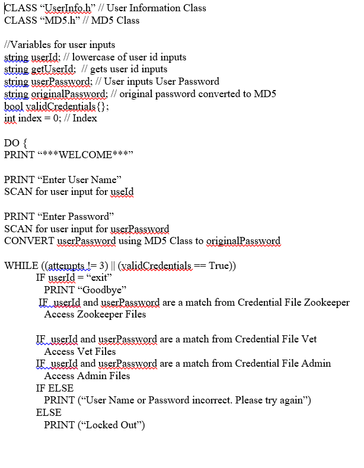

# Jamie Barrett-Fetters

### Professional Self Assessment
Welcome to my portfolio. I am currently at Southern New Hampshire University obtaining a bachelor's degree in Computer Science. I am aspiring to develop my skills within my current career combining software engineering and information security. Each opportunity and experience I have had has helped strenghten and clarify my future career goals within the Computer Science field. 

I love bowling, playing software, mountain and roading bicyclin, riding motorcycle and spending time with family and friends. I am always up for a adventure wether it is on the motorcycle or enjoying time with my newphews. 

This page will give you a glimpse into who I am and display my projects and experiences that have shaped me. During the course of my degree I have collaborated with other students on discussion boards and group assessment. CS-310, Collaboration and Team Project, we, as a class, learned how to use GitHub as a group to make changes to the Jukebox code, creating changelogs, peer reviews, and more. Learning to communicate to stakeholders so that they understand computer system security, network security and why we need to protect our assets, understanding data by mining understand the trends and conveying why we need to practice standard coding techniques and ensure that the code is secure as possible to avoid SQL injection, buffer overflow, and other attacks threat actors will try to use.

Over the course of CS-499 Capstone I took my first coding project, the Zoo Authentication System, to create my final project. The final project addresses software design and engineering, data structures and algorithms and database. In the next sections you will see why I choses the project from the code review and how I addressed each section. The reason why I selected this for this portfolio was because it was my first coding program and throughout obtaining my degree I learned what could be done to change and improve the code.

## Software Design, Engineering, Algorithms and Data Structures
```markdown
The Zoo Authentication system that was from Course IT-145 Fundamentals of Information Technology where we learn various roles and functions of IT professionals and basic technologies, hardware, software and systems thinking approach to sovling problems. The program was original written in Java. For the redesigned and engineered it was re-written to C++.


[Zoo Authetication](https://github.com/JBFetters/ZooAuthentication)
```
### Code Review
```markdown
[Code Review](Debut 10.mov)
```
## Databases
```markdown
[Credential Database](https://github.com/JBFetters/JBFetters/blob/main/Credentials.cpp)
```
 <! --- (three dashes
<! ---(You can use the [editor on GitHub](https://github.com/JBFetters/JBFetters/edit/gh-pages/index.md) to maintain and preview the content for your website in Markdown //files.)

//Whenever you commit to this repository, GitHub Pages will run [Jekyll](https://jekyllrb.com/) to rebuild the pages in your site, from the content in your Markdown //files.
```markdown
```markdown


```markdown
- Bulleted
- List

1. Numbered
2. List

**Bold** and _Italic_ and `Code` text

[Link](url) and 

[Code Review](Debut 10.mov)
```

For more details see [Basic writing and formatting syntax](https://docs.github.com/en/github/writing-on-github/getting-started-with-writing-and-formatting-on-github/basic-writing-and-formatting-syntax).

### Jekyll Themes

Your Pages site will use the layout and styles from the Jekyll theme you have selected in your [repository settings](https://github.com/JBFetters/JBFetters/settings/pages). The name of this theme is saved in the Jekyll `_config.yml` configuration file.

### Support or Contact

Having trouble with Pages? Check out our [documentation](https://docs.github.com/categories/github-pages-basics/) or [contact support](https://support.github.com/contact) and we’ll help you sort it out.
